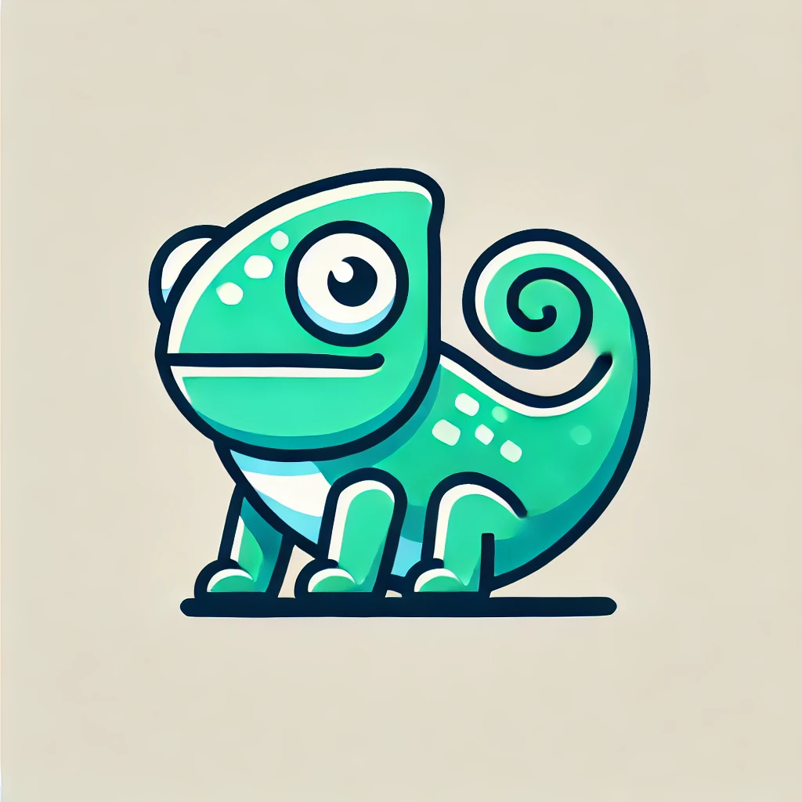

# 🦎🚀 Chamt Server

**Chamt** — это сервер для чата, использующий **Go** для максимальной производительности и гибкости. Название **Chamt** происходит от слов **Chameleon** (хамелеон) и **Chat**.

---

## 📸 Логотип

<<<<<<< HEAD

=======
---

## 🛠️ **Технологии**

- **Go** — для основной логики сервера.
- **JavaScript+HTML+CSS** - для фронтенда проекта
---

## 🚀 **Как запустить проект**

### 1. Установка зависимостей

Убедитесь, что у вас установлены **Go**.

- **Go**: [Установка Go](https://golang.org/dl/)

### 2. Клонирование репозитория

```bash
git clone https://github.com/Akulalu07/chat.git
cd chat
chmod +x start.sh  
./start.sh 
